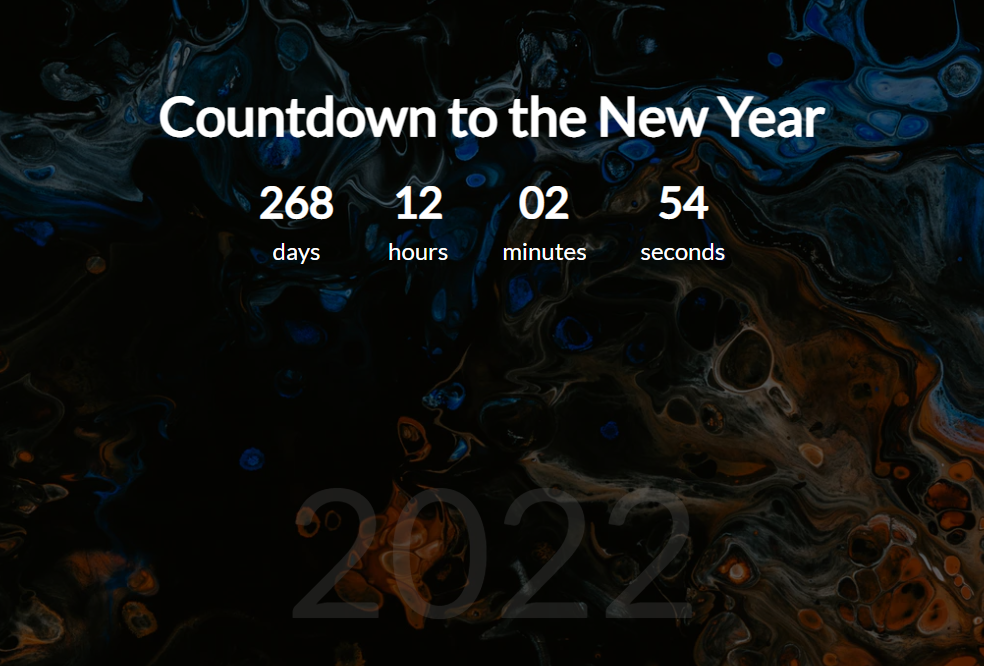

<h1 align="center">Countdown with JS Vanilla</h1>

<h2> 🖥 Projeto:</h2>

Contagem regressiva para o próximo ano utilizando Javascript puro.

<h2> ⚙ Tecnologias:</h2>

- HTML5  
  - CSS3  
  - JavaScript
  

<h2> 💻 Como acessar:</h2>

Clone o repositório: https://github.com/ramonxm/countdown-js.git  
  e acesse utilizando a extensão Live Server.

 

Desenvolvido por [Ramon Xavier](github.com/ramonxm) 👓
